# Пояснительная записка к проекту "Продуктовый Рай"

---

# Описание проекта
Проект представляет собой сайт продуктового магазина. Он включает 
  в себя следующие элементы: 
1. Главная страница - первое, что видит пользователь при переходе на сайт. 
   В самом верху располагается карусель со всеми акциями магазина. Ниже 
   располагаются карточки с базовыми категориями товаров. Если по ним 
   кликнуть, то пользователь переходит на страницу каталога с уже 
   предустановленными фильтрами категорий, в зависимости от выбранной 
   карточки. Еще ниже располагаются товары со скидками - карусель с 
   карточками. Можно как добавить эти товары в корзину, так и посмотреть 
   детальную информацию о товаре 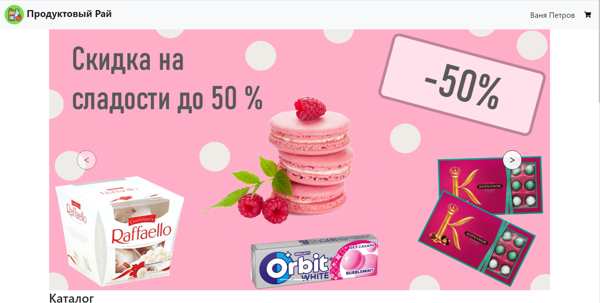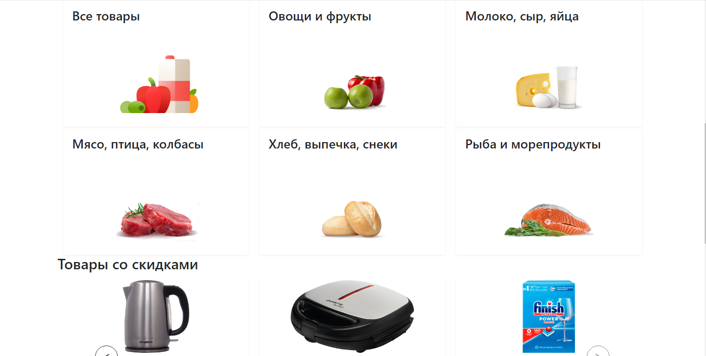
2. Следующее - каталог. Здесь располагаются карточки с товарами. Можно 
   либо добавить товар в корзину, либо узнать детальную информацию о 
   товаре (карточки просто такие же, как и с главной страницы). Имеется 
   левая боковая панель - фильтр. Тут есть листающийся список с 
   категориями, которые нужно выбрать и ползунок для изменения диапазона 
   цены (устанавливается максимальная цена с помощью ползунка) 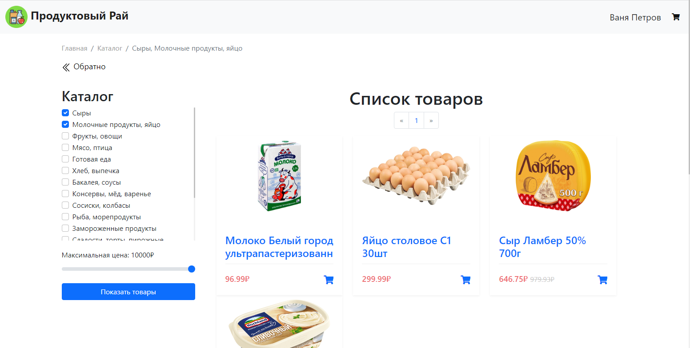
3. Касательно нажатий на карточку - при нажатии на карточку (не значок 
   корзины) открывается страница с подробной информацией о товаре. Здесь 
   располагается фотография товара, цена, характеристики (пищевая ценность,
   характеристики и условия хранения товара), описание и состав товара. 
   Эти элементы могут выводиться или не выводиться в зависимости от 
   наличия записей в БД. 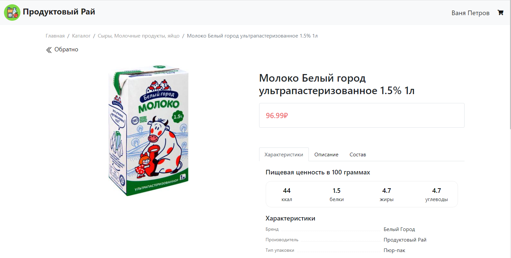
4. Панель навигации - здесь слева располагается иконка сайта и его 
   название, справа - иконка корзины и имя пользователя или иконка профиля 
   (выпадающий список: регистрация, авторизация). 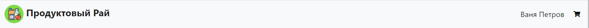
5. Корзина - здесь располагаются все товары, которые пользователь добавил 
   с помощью соответсвующих кнопок на карточках. Имеет вид таблицы: 
   изображение, название, цена за 1шт, за все количество данной позиции в 
   корзине и количество данного вида товара в корзине. Можно либо корзину 
   закрыть, либо оплатить все товары (сама оплата не реализована, просто 
   формируется заказ - добавляется соответсвующая модель данных в БД). 
   Также можно с помощью кнопочек ("+", "-") добавлять / убирать товары из 
   корзины 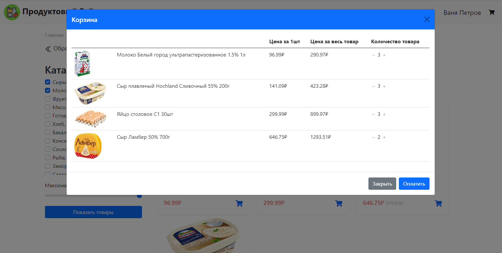
6. Регистрация - имеет вид формы, куда пользователь вводит номер телефона 
   (уникальный ключ в БД), имя, фамилию и пароль (2 раза) 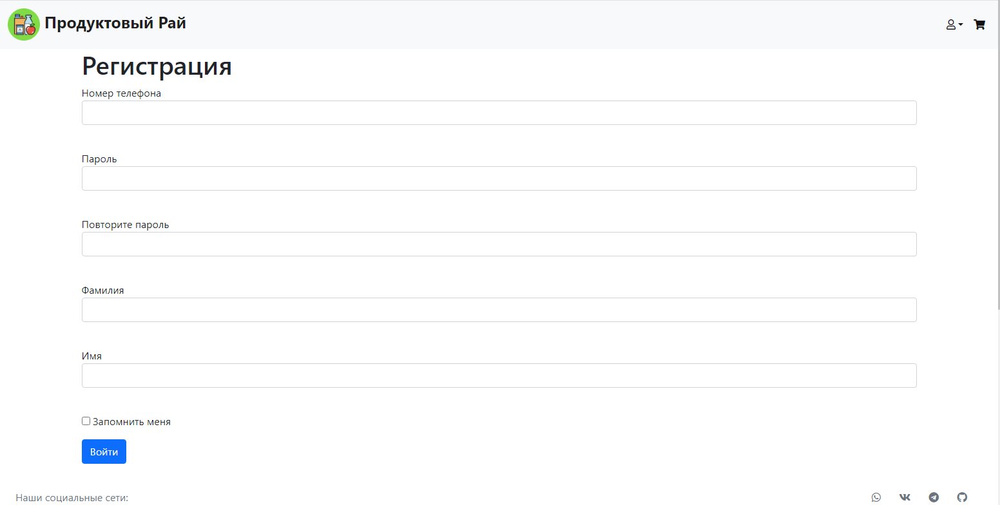
7. Авторизация - имеет вид формы, куда пользователь вводит номер телефона 
   и пароль, чтобы получить доступ к функции корзины 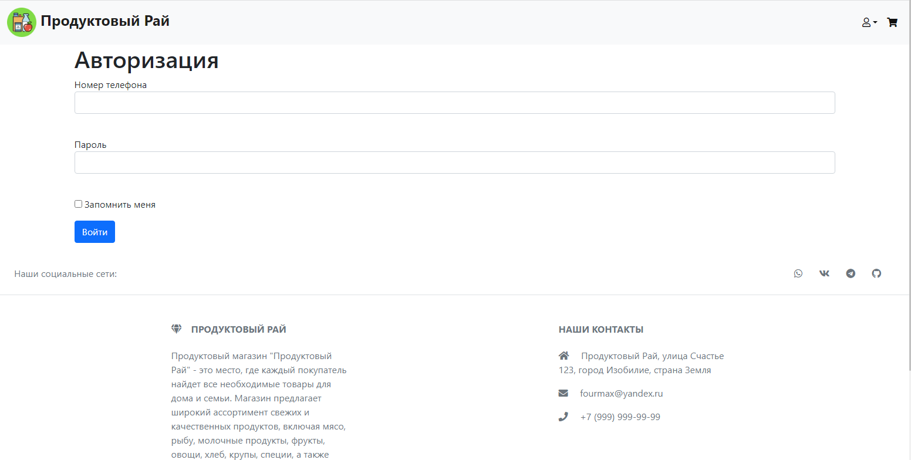
8. Личный кабинет - страница, включающая следующие элементы: вкладка с 
   личными данными, вкладка с заказами и панелька выбора этих разделов (в 
   виде карточек). Во вкладке с разделами можно увидеть информацию о 
   пользователе - номер телефона, имя и фамилию. В этой же вкладке имеется 
   кнопка редактирования этой информации - также в виде формы. Во вкладке 
   с заказами пользователь может увидеть все свои покупки - ID заказа, 
   стаутс и список товаров из этого заказа. Также под переключателем 
   вкладок имеется кнопка выхода из профиля 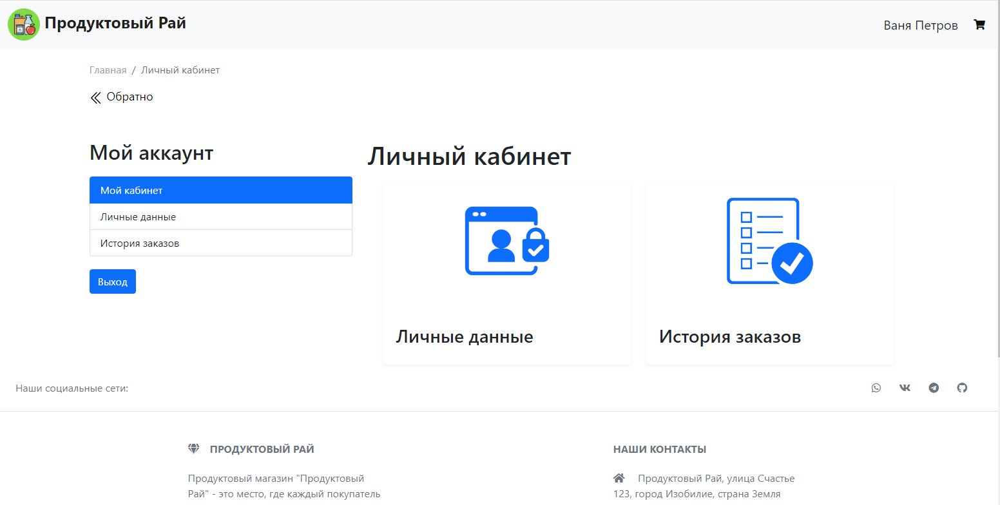 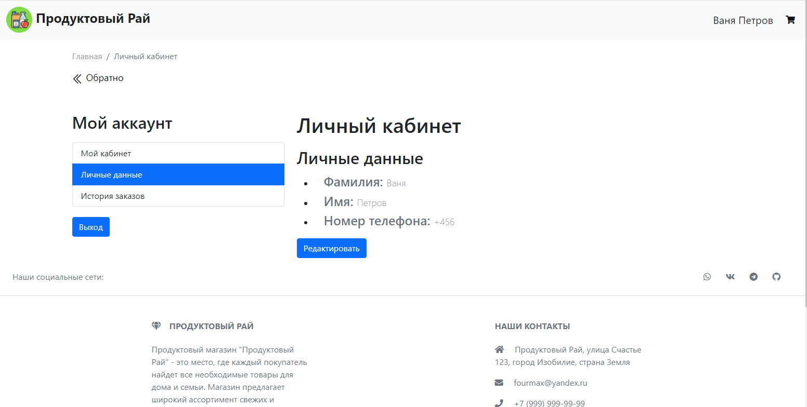 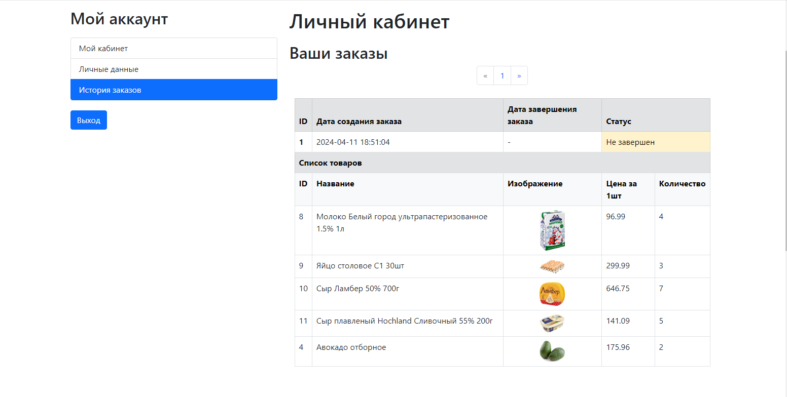
9. Также имеется админская страничка - здесь имеется также несколько 
   вкладок: категории, товары, поставщики - все таблички из БД. Их админ 
   может просматривать, а также удалять или редактировать. Редактирование 
   также реализовано с помощью формочек. 

---

# Структура проекта

+ ***api*** - папочка со всеми самостоятельными api (какие-то отдельные функции, которые неуместно добавлять в какой-то из ресурсов)
	+ ***calculate_cost_api.py*** - api, которое отвечает за подсчет стоимости списка товаров
+ ***data*** - всякие файлики с данными
	+ ***\_\_all_models*** - все модели БД
	+ ***categories.py*** - табличка с категориями товаров
	+ ***constants.py*** - все константы приложения
	+ ***db_session.py*** - для работы с сессиями БД
	+ ***items.py*** - табличка с товарами
	+ ***orders.py*** - табличка с заказами пользователей
	+ ***secret_key*** - секретный ключ для зазиты от межсайтовой подделки запросов
	+ ***suppliers.py*** - табличка с поставщиками
	+ ***users.py*** - табличка с пользователями
+ ***db*** - все БД
	+ ***shop.db*** - основная БД (**НИ В КОЕМ СЛУЧАЕ НЕ ТРОГАТЬ ЕЁ!!!**)
	+ ***shop_test.db*** - БД для тестов (можно смело с ней делать, что угодно: удалять, изменять и т.д.)
+ ***forms*** - все формочки
    + ***user.py*** - формочки авторизации и регистрации + админские формочки
+ ***resources*** - все ресурсы
	+ ***categories_resources.py*** - ресурс с категориями
	+ ***items_resources.py*** - ресурс с товарами
	+ ***orders_resources.py*** - ресурс с заказами
	+ ***suppliers_resources.py*** - ресурс с поставщиками
	+ ***users_resources.py*** - ресурс с пользователями
+ ***static***
    + ***css*** - все css файлики
      + ***style.css*** - файл со стилями 
      + ***normalize.css*** - файл с нормализацией (взято отсюда: [github.com/necolas/normalize.css]())
    + ***img*** - все картинки
      + ***admin***
        + ***items.png*** - вкладка с товарами
        + ***suppliers.png*** - вкладка с поставщиками
        + ***users.png*** - вкладка с пользователями
      + ***home_page***
        + ***cat_1.png*** - карточка со всеми товарами
        + ***cat_2.png*** - карточка с фруктами / овощами
        + ***cat_3.png*** - карточка с молочкой + яйцами
        + ***cat_4.png*** - карточка с мясом
        + ***cat_5.png*** - карточка с выпечкой
        + ***cat_6.png*** - карточка с рыбой
      + ***items***
      + ***personal_account_cards*** - карточки для переключения вкладок в 
		личном кабинете
        + ***card_1.png*** - вкладка с личными данными
        + ***card_2.png*** - вкладка с заказами
      + ***slides*** - слайды для акций
      + ***brand_img.png*** - логотип разработчика
      + ***nav_icon.png*** - логотип сайта
    + ***js*** - все js скрипты
      + ***admin_script.js*** - скрипт для админской странички
      + ***item_list_script.js*** - скрипт для странички с каталогом
      + ***item_page_script.js*** - скрипт для странички с товаром
      + ***personal_account_script.js*** - скрипт для странички личного 
		кабинета
      + ***base_script.js*** - скрипт для базового шаблона
+ ***tests*** - все тесты
	+ ***category_api_test.py*** - тесты api категорий
	+ ***items_api_test.py*** - тесты api товаров
	+ ***suppliers_api_test.py*** - тесты api поставщиков
	+ ***test.py*** - сюда импортируются все тесты, запускать нужно именно этот файл в командной строке
	+ ***user_api_test.py*** - тесты api пользователей
+ ***main.py*** - через этот файл запускается сервер в командной строке
+ ***README.md*** - мы здесь :)
+ ***technical_specification.md*** - ТЗ проекта

---
# Запуск сервера

Запуск сервера осуществляется с помощью файла main.py

```shell
python server.py
```

---
# Тестирование

Тестирование осуществляется для проверки корректности всех api проекта. Выполняется через запуск файла ***test.py*** через командную строку.

```shell
pytest tests/test.py
```

ПЕРЕД ЗАПУСКОМ ТЕСТОВОГО ФАЙЛА, ОБЯЗАТЕЛЬНО ЗАПУСТИТЬ СЕРВЕР!!!

ПЕРЕД ТЕСТИРВОАНИЕМ НУЖНО ОБЯЗАТЕЛЬНО ЗАМЕНИТЬ ССЫЛКУ НА ТЕСТОВУЮ БД В ФАЙЛЕ ***main.py***!!!

```python
db_session.global_init(f'db/{TEST_DB_NAME}')
```

---
# Список api

В проекте имеются следующие api:
+ ***HttpGet('/api/orders')*** - получение списка всех заказов
+ ***HttpPost('/api/orders')*** - добавление нового заказа
+ ***HttpGet('/api/orders/<int:order_id>')*** - получение заказа по id
+ ***HttpDelete('/api/orders/<int:order_id>')*** - удаление заказа по id
 
+ ***HttpGet('/api/users')*** - получение списка всех пользователей
+ ***HttpPost('/api/users')*** - добавление нового пользователя
+ ***HttpGet('/api/users/<int:user_id>')*** - получение пользователя по id
+ ***HttpDelete('/api/users/<int:user_id>')*** - удаление пользователя по id
 
+ ***HttpGet('/api/items')*** - получение списка всех товаров
+ ***HttpPost('/api/items')*** - добавление нового товара
+ ***HttpGet('/api/items/<int:item_id>')*** - получение товара по id
+ ***HttpDelete('/api/items/<int:item_id>')*** - удаление товара по id

+ ***HttpGet('/api/categories')*** - получение списка всех категорий
+ ***HttpPost('/api/categories')*** - добавление новой категории
+ ***HttpGet('/api/categories/<int:category_id>')*** - получение категории по id
+ ***HttpDelete('/api/categories/<int:category_id>')*** - удаление категории по id

+ ***HttpGet('/api/suppliers')*** - получение списка всех поставщиков
+ ***HttpPost('/api/suppliers')*** - добавление нового поставщика
+ ***HttpGet('/api/suppliers/<int:supplier_id>')*** - получение поставщика по id
+ ***HttpDelete('/api/suppliers/<int:supplier_id>')*** - удаление поставщика по id

+ ***HttpGet('/api/calculate/<int:order_id>')*** - получение стоимости заказа по его id